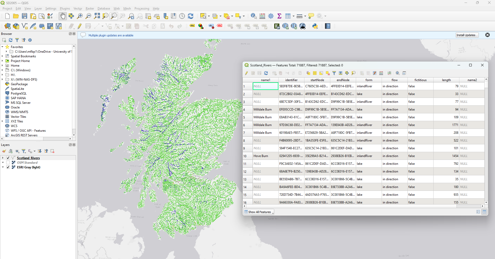

## Scotland's Housing Crisis

**You've been hired by the Scottish Government to analyze:**

- Housing affordability across Scottish cities
- Population density and urban growth
- Transport accessibility impact on prices
- Student population effects on housing markets

**Your tools:** Python + Pandas + Your Spatial knowledge

---

## From QGIS to Python
### What You Already Know

| QGIS Concept | Python Equivalent | Why It Matters |
|--------------|-------------------|----------------|
| Attribute Table | DataFrame | Core data structure |
| Select by Expression | Boolean Indexing | Filter spatial features |
| Field Calculator | Column Operations | Create new attributes |
| Join Attributes | merge()/join() | Combine datasets |
| Summary Statistics | describe()/groupby() | Spatial statistics |

**Key:** *A DataFrame is just a programmable attribute table!*

---



---

## Your First Spatial DataFrame

```python
import pandas as pd
import numpy as np

# Load Scottish cities data
scottish_cities = pd.DataFrame({
    'city': ['Edinburgh', 'Glasgow', 'Aberdeen', 'Dundee', 
             'Inverness', 'Stirling', 'Perth'],
    'population': [540000, 635000, 198000, 148000, 
                   47000, 37000, 51000],
    'area_km2': [264, 368, 186, 60, 37, 22, 17],
    'elevation_m': [47, 8, 13, 17, 7, 26, 15],
    'coastal': [True, False, True, True, True, False, False],
    'region': ['Lothian', 'Strathclyde', 'Grampian', 'Tayside',
               'Highland', 'Central', 'Tayside']
})

print(scottish_cities.head())
```

**This is your attribute table but now in Python!**

---

## Essential Pandas Operations
### 1. Exploring Your Spatial Data

```python
# Quick overview - like opening attribute table in QGIS
scottish_cities.info()

# Summary statistics
scottish_cities.describe()

# Unique values in categorical fields
scottish_cities['region'].value_counts()

# Find specific features
capital = scottish_cities[scottish_cities['city'] == 'Edinburgh']
```

**Note:** Always start with `.info()` and `.head()` 
- your data exploration

---

## 2. Creating New Spatial Attributes

```python
# Calculate population density (people per km²)
scottish_cities['density'] = scottish_cities['population'] / scottish_cities['area_km2']

# Classify cities by size
scottish_cities['size_category'] = pd.cut(
    scottish_cities['population'],
    bins=[0, 50000, 200000, 700000],
    labels=['Small', 'Medium', 'Large']
)

# Create urban intensity index
scottish_cities['urban_intensity'] = (
    scottish_cities['density'] * 
    (scottish_cities['elevation_m'] < 20).astype(int)
)
```

**Real application:** Urban planners use these metrics for development decisions

---

## 3. Filtering Spatial Features

```python
# Cities over 100,000 population
major_cities = scottish_cities[scottish_cities['population'] > 100000]

# Coastal cities with high density
coastal_dense = scottish_cities[
    (scottish_cities['coastal'] == True) & 
    (scottish_cities['density'] > 1000)
]

# Using query method (more readable)
highland_cities = scottish_cities.query("region == 'Highland'")
```

**In terms of QGIS:** This is your "Select by Attributes" in Python!

---

## 4. Spatial Data Joins

```python
# Load transport data
transport_data = pd.DataFrame({
    'city': ['Edinburgh', 'Glasgow', 'Aberdeen', 'Dundee'],
    'train_stations': [2, 2, 1, 1],
    'airport': [True, True, True, False],
    'motorway_access': [True, True, True, True]
})

# Join with city data (like QGIS table join)
cities_with_transport = scottish_cities.merge(
    transport_data, 
    on='city', 
    how='left'  # Keep all cities even without transport data
)

print(cities_with_transport[['city', 'population', 'train_stations', 'airport']])
```

---

## 5. Aggregating Spatial Data

```python
# Regional statistics (like Dissolve in QGIS)
regional_stats = scottish_cities.groupby('region').agg({
    'population': 'sum',
    'area_km2': 'sum',
    'city': 'count'
}).rename(columns={'city': 'num_cities'})

# Calculate regional population density
regional_stats['regional_density'] = (
    regional_stats['population'] / regional_stats['area_km2']
)

print(regional_stats.sort_values('population', ascending=False))
```

**Use case:** Regional planning and resource allocation

---

## Real-World Application
### Housing Affordability Analysis

```python
# Load housing data
housing_data = pd.DataFrame({
    'city': ['Edinburgh', 'Glasgow', 'Aberdeen', 'Dundee', 
             'Inverness', 'Stirling', 'Perth'],
    'avg_house_price': [335000, 195000, 185000, 165000, 
                        235000, 275000, 220000],
    'avg_rent_monthly': [1400, 950, 900, 750, 850, 1100, 900],
    'new_builds_2023': [2500, 3200, 800, 650, 400, 350, 450]
})

# Merge all datasets
complete_data = cities_with_transport.merge(housing_data, on='city')

# Calculate affordability metrics
avg_salary = 32000  # Scottish average
complete_data['price_to_income'] = complete_data['avg_house_price'] / avg_salary
complete_data['annual_rent'] = complete_data['avg_rent_monthly'] * 12
complete_data['rent_yield'] = (complete_data['annual_rent'] / 
                                complete_data['avg_house_price'] * 100)
```

---

## Visualizing Spatial Patterns

```python
import matplotlib.pyplot as plt

# Scatter plot: Population vs House Prices
fig, (ax1, ax2) = plt.subplots(1, 2, figsize=(12, 5))

# Population vs Price
ax1.scatter(complete_data['population'], 
           complete_data['avg_house_price'],
           s=complete_data['density']*10, 
           alpha=0.6)
ax1.set_xlabel('Population')
ax1.set_ylabel('Average House Price (£)')
ax1.set_title('Scottish Cities: Population vs House Prices')

# Add city labels
for idx, row in complete_data.iterrows():
    ax1.annotate(row['city'], (row['population'], row['avg_house_price']))

# Affordability by region
regional_affordability = complete_data.groupby('region')['price_to_income'].mean()
regional_affordability.plot(kind='bar', ax=ax2)
ax2.set_title('Housing Affordability by Region')
ax2.set_ylabel('Price to Income Ratio')

plt.tight_layout()
plt.show()
```

---

## Handling Missing Spatial Data

```python
# Real-world data has gaps!
incomplete_data = complete_data.copy()
incomplete_data.loc[2, 'train_stations'] = np.nan
incomplete_data.loc[4, 'airport'] = np.nan

# Strategy 1: Fill with regional average
incomplete_data['train_stations'].fillna(
    incomplete_data.groupby('region')['train_stations'].transform('mean'),
    inplace=True
)

# Strategy 2: Fill with mode for categorical
incomplete_data['airport'].fillna(
    incomplete_data['airport'].mode()[0],
    inplace=True
)

# Strategy 3: Forward fill for time series
# df['value'].fillna(method='ffill')
```
---

## Tips for Large Spatial Datasets

### 1. Use Appropriate Data Types (Key)

```python
# Convert to category for repeated text (saves memory)
scottish_cities['region'] = scottish_cities['region'].astype('category')
scottish_cities['city'] = scottish_cities['city'].astype('category')

# Use smaller integer types when possible
scottish_cities['elevation_m'] = scottish_cities['elevation_m'].astype('int16')
```

### 2. Vectorized Operations

```python
# Slow (loop)
densities = []
for idx, row in scottish_cities.iterrows():
    densities.append(row['population'] / row['area_km2'])

# Fast (vectorized)
densities = scottish_cities['population'] / scottish_cities['area_km2']
```

---

## Common Pitfalls to Avoid

### The SettingWithCopyWarning

```python
# Wrong - might not work as expected
subset = scottish_cities[scottish_cities['population'] > 100000]
subset['new_column'] = 100  # Warning!

# Right - explicit copy
subset = scottish_cities[scottish_cities['population'] > 100000].copy()
subset['new_column'] = 100  # Safe!
```

### Forgetting About Index

```python
# After filtering, index might not be sequential
filtered = scottish_cities[scottish_cities['coastal'] == True]
print(filtered.index)  # [0, 2, 3, 4]

# Reset if needed
filtered_reset = filtered.reset_index(drop=True)
print(filtered_reset.index)  # [0, 1, 2, 3]
```

---

## Summary:

### Essential Methods for Spatial Analysis

| Method | Use Case | Example |
|--------|----------|---------|
| `read_csv()` | Load data | `pd.read_csv('cities.csv')` |
| `merge()` | Join tables | `df1.merge(df2, on='id')` |
| `groupby()` | Regional stats | `df.groupby('region').mean()` |
| `query()` | Filter features | `df.query('pop > 50000')` |
| `assign()` | New attributes | `df.assign(density=...)` |
| `plot()` | Quick visualization | `df.plot(x='lon', y='lat')` |

---

## More Resources

### Documentation
- [Pandas Documentation](https://pandas.pydata.org/docs/)
- [Python Data Science Handbook](https://jakevdp.github.io/PythonDataScienceHandbook/)

### Cheat Sheets
- [Pandas Cheat Sheet](https://pandas.pydata.org/Pandas_Cheat_Sheet.pdf)
- [Data Wrangling Tidy Data](https://pandas.pydata.org/Pandas_Cheat_Sheet.pdf)

### Practice Datasets
- [Scottish Government Statistics](https://statistics.gov.scot/)
- [UK Census Data](https://www.scotlandscensus.gov.uk/)
- [OpenStreetMap](https://www.openstreetmap.org/)
~~~~
---

## Questions?


